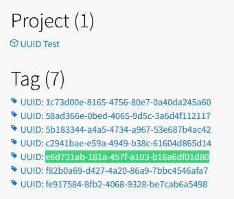
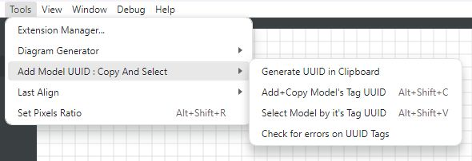
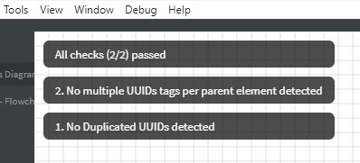

> [!CAUTION]
>
> **Version 1.x.x is not compatible with previous versions 0.x.x**

---

# About

This is an extension for [StarUML.io](https://staruml.io/) S/W which aids the users to generate UUIDs for each selected element of their models in order to make references these elements, at documentation and/or the source code.

The UUIDs are generated as:

- A new ***Tag*** inside the element, wherever it's permittable.

- The Tag has always name `UUID: <uuid>` and is of `string` kind. At it's `value` field it contains an empty string, which can be used for any user cause.

  - The `uuid` is generated using the `crypto.randomUUID()` algorithm and it's of the UUID v4 standard format like:
    `e4f3c066-87a6-487d-9e89-514b58ab60a2`
  - To this end, tags are named as `UUID: e4f3c066-87a6-487d-9e89-514b58ab60a2`

- Because the UUID is on the name of the tag, it's possible the UUID tags to be searched and referenced even from the HTML Docs export, from the Index page, as shown below. From there it's possible using the backwards linking to identify, for example, that the UUID `e6d731ab-181a-457f-a103-b16a6df01d80` which is somewhere stored in documentation or source code as reference, corresponds to "Class 2" element:  
  

  

> [!IMPORTANT]
>
> If you have already installed the extension [StarUML-ModelIdCopyAndSelect](https://github.com/terablade2001/StarUML-ModelIdCopyAndSelect) <u>it's proposed to uninstalled it first</u>, because it's uses the same shortcuts with this "**StarUML-AddModelUUID-CopyAndSelect**" extension.


# Extension's menu

> [!NOTE]
>
> The following information is rereferred to the **version 1.0.1**.

Below is shown this extension's menu.



There are 4 options:

1. **Generate UUID in Clipboard**: It generates a UUID and copies it to Clipboard thus the user to be able to paste it anywhere he may need. So it may be useful if for any case, there is the need to update manually a UUID with another.

2. **Add+Copy Model's Tag UUID**: User must have first select an appropriate element/model. If the selected element/model has not the `UUID` tag, that tag is created with a new UUID first. Then the UUID value which exist in the `UUID` tag of the selected element/model is copied to clipboard and is available to the user to use it for reference in documentation or source code.

3. **Select Model by it's Tag UUID**: The user is expected to have copied the wanted UUID from the documentation or source code to the clipboard. Then using this functionality the extensions finds the tag containing the value of the user's UUID, and ***auto-selects the parent element*** of the tag in the *Model Explorer*. To this end, with *Ctrl+E* the user can find directly the element/model with the wanted UUID in the Explorer window, and with *Ctrl+D* to also find it in a used diagram.

4. **Check for errors on UUID Tags**: This enables currently two kinds of checks  

   - **Check for Duplicated UUIDs**: While the idea behind the UUIDs is to be unique in a global scale, this tool checks if there are any `UUID` tags with the same uuid value in their name. If this is the case, then this option copies to Clipboard a report like the following example, where the parents `name` and `_id` fields where duplicated UUID tags found are provided:  
      ```
       - Duplicated UUID[ca566449-742f-4536-8cfd-dc27fab351f3] detected at    elements with parent _id's:
      name: [Untitled], _id: [ AAAAAAFF+h6SjaM2Hec= ]
      name: [Model], _id: [ AAAAAAFF+qBWK6M3Z8Y= ]
      ```
      ► Notice that these `_id`s are not unique and not safe to use, but still can be easily accessed and used in a similar manner using the corresponding extension [StarUML-ModelIdCopyAndSelect](https://github.com/terablade2001/StarUML-ModelIdCopyAndSelect). However have in mind that using this old extension it may re-wire the shortcuts Alt+Shift+C and Alt+Shift+V (see  the "*important*" note above).
   - **Check for Multiple UUID tags under elements**: If more than one UUID tags are existing under a single element, this check will provide an error along with all relative information thus the user to manually correct the situation. The result is copied to the clipboard as a form of:
     
      ```
      - Multiple UUID Tags found at element [Untitled] with _id [ AAAAAAFF+h6SjaM2Hec= ]
      UUID: a1991a16-5521-4f36-8796-703abf315bbc
      UUID: aa566449-742f-4536-8cfd-dc27fab351f3
      ```
   
     If everything is OK then the result is like as following:  
     